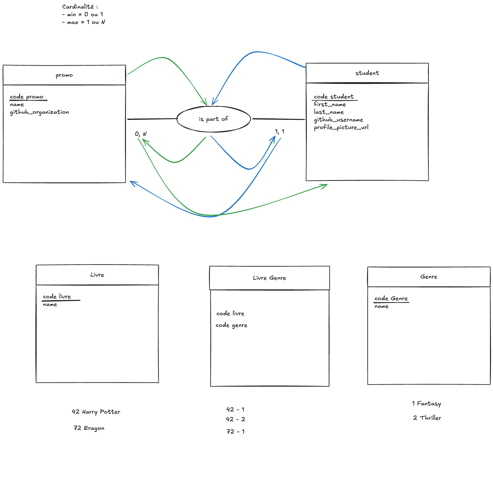

# MLD

## MCD

En partant du MCD

## MLD

Nommage MCD => MLD:

- code => id
- Entité => Table
- Attribut => Colonne
- Relation => Clé étrangère (on ajoute un marqueur # pour indique que la colonne est une clé étrangère)

Ce qui donne le MLD suivant:

- Promo (id, name, github_organization)
- Student (id, first_name, last_name, github_username, profile_pcture_url, #promo_id)
